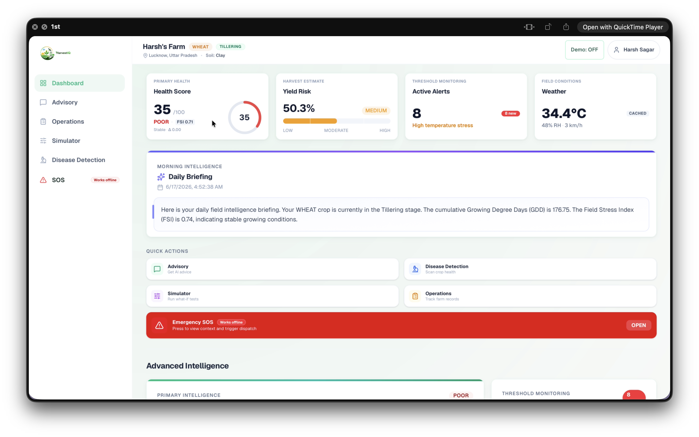
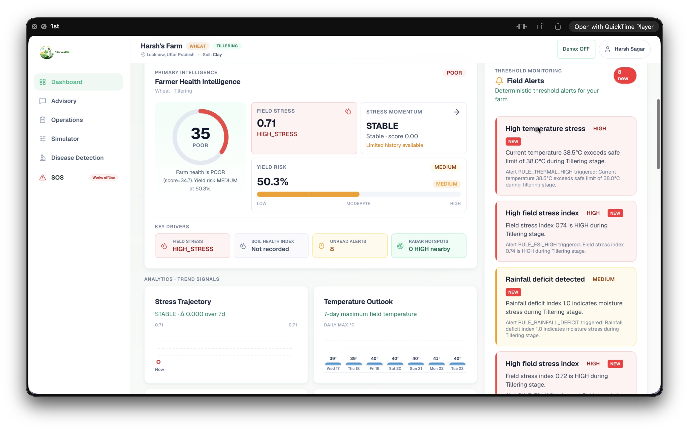
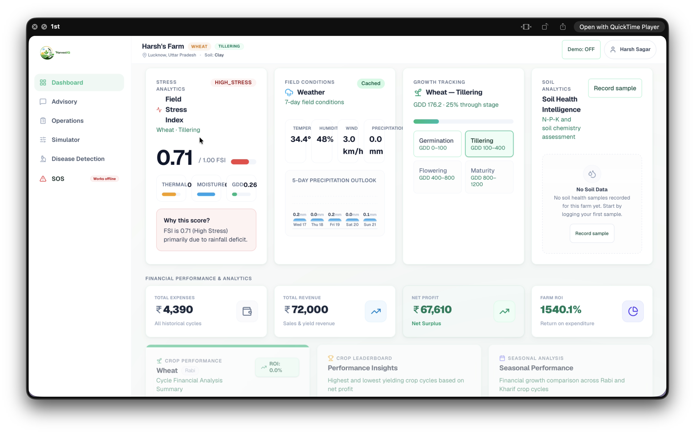
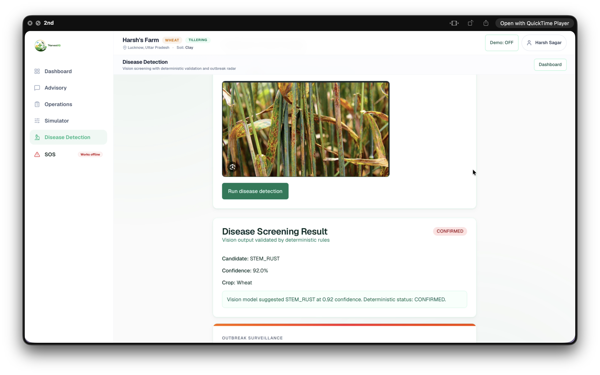
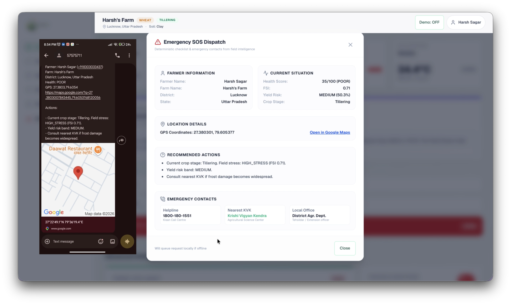

<div align="center">

# 🌾 HarvestIQ

### AI-Powered Farm Intelligence Platform for Smarter Agricultural Decision Making

[](https://nextjs.org/)
[](https://fastapi.tiangolo.com/)
[](https://www.mongodb.com/)
[](https://openrouter.ai/)
[](https://vercel.com/)
[](https://render.com/)
[](https://python.org/)
[](https://typescriptlang.org/)

**An end-to-end AI-powered agricultural intelligence platform that combines disease detection, weather intelligence, farm health monitoring, profitability analytics, and emergency response into a unified decision-support system for farmers.**

</div>

---

# Live Deployment

### Frontend
https://harvest-iq.vercel.app

### Backend API
https://harvestiq-10ww.onrender.com

---

# Overview

Modern agriculture faces numerous challenges including crop diseases, unpredictable weather, inefficient resource allocation, delayed interventions, and limited access to actionable insights.

HarvestIQ addresses these challenges through a unified intelligence platform that helps farmers make faster and more informed decisions using artificial intelligence, real-time analytics, and agricultural intelligence systems.

The platform integrates:

- AI Disease Detection
- Weather Intelligence
- Farm Health Monitoring
- Profitability Analytics
- SOS Emergency Assistance
- Disease Outbreak Surveillance
- Smart Advisory Generation
- Farm Operations Intelligence
- Agricultural Simulation Engine

into a single farmer-centric ecosystem.

---

# Screenshots

## Dashboard Overview

<p align="center">
  
</p>

---

## Farm Intelligence Dashboard

<p align="center">
  
</p>

---

## Analytics & Monitoring

<p align="center">
  
</p>

---

## AI Disease Detection

<p align="center">
  
</p>

---

## SOS Emergency Response

<p align="center">
  
</p>

---

# Core Features

## Smart Farm Dashboard

Comprehensive farm monitoring dashboard providing real-time visibility into farm performance and health.

### Features

- Farm health overview
- Crop monitoring
- Weather intelligence
- Health card generation
- Farm stress analysis
- Productivity insights
- Season performance tracking

---

## AI Disease Detection

Identify crop diseases using AI-powered image analysis.

### Capabilities

- Crop image upload
- Vision-based disease diagnosis
- Confidence scoring
- Risk assessment
- Treatment recommendations
- Early intervention support

---

## SOS Emergency Assistance

Emergency response workflow for critical farm situations.

## Important Notes

### SOS Emergency Feature

The SOS module is integrated with Twilio for SMS/call notifications.

**Current Limitation:** Due to Twilio trial account restrictions, SOS alerts can currently be delivered only to phone numbers that have been verified in the Twilio console. Unverified numbers will not receive SMS/call notifications.

For hackathon evaluation purposes, the feature is fully implemented and functional, but successful message delivery is limited to Twilio-verified recipient numbers.

### Capabilities

- Emergency alerts
- Priority notifications
- Rapid escalation workflows
- Crisis response support
- Emergency decision assistance

---

## Weather Intelligence

Weather-driven agricultural planning system.

### Features

- Forecast monitoring
- Temperature tracking
- Rainfall predictions
- Weather-based recommendations
- Crop-specific advisories

---

## Profitability Analytics

Analyze financial performance across farm operations.

### Includes

- Revenue analysis
- Expense tracking
- Profit calculations
- Seasonal comparisons
- Crop profitability insights
- Financial dashboards

---

## Disease Outbreak Radar

Monitor disease outbreaks across nearby regions.

### Features

- Disease surveillance
- Risk assessment
- Regional outbreak monitoring
- Early warning indicators
- Preventive recommendations

---

## Advisory Engine

Generate actionable agricultural recommendations.

### Advisory Areas

- Irrigation planning
- Fertilizer management
- Disease prevention
- Weather adaptation
- Crop management
- Risk mitigation

---

## Agricultural Simulation Engine

Evaluate agricultural decisions before implementation.

### Simulation Areas

- Resource allocation
- Crop planning
- Yield projections
- Risk analysis
- Operational optimization

---

# System Architecture

```text
                           ┌─────────────────────┐
                           │       Farmer        │
                           └──────────┬──────────┘
                                      │
                                      ▼

                     ┌─────────────────────────────────┐
                     │        Next.js Frontend         │
                     │            (Vercel)            │
                     └──────────────┬──────────────────┘
                                    │
                                    ▼

                     ┌─────────────────────────────────┐
                     │         FastAPI Backend         │
                     │            (Render)            │
                     └──────────────┬──────────────────┘
                                    │
            ┌───────────────────────┼───────────────────────┐
            │                       │                       │
            ▼                       ▼                       ▼

 ┌──────────────────┐   ┌──────────────────┐   ┌──────────────────┐
 │  MongoDB Atlas   │   │   OpenRouter AI  │   │  Weather APIs    │
 │  Farm Database   │   │ Disease Models   │   │ Forecast Engine  │
 └──────────────────┘   └──────────────────┘   └──────────────────┘
```

---

# Technology Stack

## Frontend

- Next.js 15
- React
- TypeScript
- Tailwind CSS
- Zustand
- Progressive Web App (PWA)

## Backend

- FastAPI
- Python 3.12
- Pydantic
- JWT Authentication
- Motor (MongoDB Driver)

## Database

- MongoDB Atlas

## AI & Intelligence Layer

- OpenRouter
- Vision Models
- Agricultural Advisory Generation
- Disease Detection Engine

## Deployment

- Vercel
- Render

---

# Project Structure

```bash
HarvestIQ
│
├── harvestiq-client/
│   ├── src/
│   ├── public/
│   ├── components/
│   ├── hooks/
│   └── stores/
│
├── harvestiq-engine/
│   ├── app/
│   │   ├── api/
│   │   ├── core/
│   │   ├── models/
│   │   ├── services/
│   │   └── integrations/
│   │
│   ├── data/
│   └── tests/
│
├── docs/
│   └── screenshots/
│
├── architecture.md
├── roadmap.md
└── README.md
```

---

# Local Setup

## Clone Repository

```bash
git clone https://github.com/harsh-sagar03/HarvestIQ.git

cd HarvestIQ
```

---

## Frontend Setup

```bash
cd harvestiq-client

npm install

npm run dev
```

Frontend:

```bash
http://localhost:3000
```

---

## Backend Setup

```bash
cd harvestiq-engine

python -m venv .venv
```

Activate environment:

### macOS/Linux

```bash
source .venv/bin/activate
```

### Windows

```bash
.venv\Scripts\activate
```

Install dependencies:

```bash
pip install -r requirements.txt
```

Start backend:

```bash
uvicorn app.main:app --reload
```

Backend:

```bash
http://localhost:8000
```

---

# Environment Variables

## Backend

```env
MONGODB_URI=

MONGODB_DB_NAME=

JWT_SECRET_KEY=

OPENROUTER_API_KEY=

OPEN_METEO_BASE_URL=

ENVIRONMENT=production
```

---

## Frontend

```env
BACKEND_URL=
```

---

# Major Modules

| Module | Description |
|----------|----------|
| Dashboard | Unified farm monitoring |
| Disease Detection | AI-based crop disease diagnosis |
| Advisory Engine | Smart agricultural recommendations |
| Weather Intelligence | Forecasting and weather analytics |
| Disease Radar | Regional disease surveillance |
| Simulator | Agricultural scenario simulation |
| Profitability | Farm financial analytics |
| SOS System | Emergency response workflows |

---

# Problem Statement

Farmers often rely on fragmented systems, delayed information, and manual processes for critical agricultural decisions.

This can result in:

- Late disease detection
- Reduced productivity
- Increased operational costs
- Resource inefficiencies
- Poor profitability visibility
- Delayed emergency response

HarvestIQ addresses these challenges through an integrated intelligence platform that combines AI, analytics, and agricultural expertise.

---

# Impact

HarvestIQ aims to:

- Improve crop health outcomes
- Enable data-driven farming
- Reduce disease-related losses
- Enhance profitability
- Improve farm resilience
- Support faster emergency response
- Deliver actionable agricultural insights

---

# Future Roadmap

### Planned Enhancements

- Satellite imagery integration
- IoT sensor support
- Mobile application
- Multilingual voice assistant
- Government scheme intelligence
- Yield prediction models
- Precision irrigation optimization
- Market intelligence forecasting

---

Responsibilities:

- Product Design
- System Architecture
- Frontend Development
- Backend Development
- AI Integration
- Database Design
- Deployment & Infrastructure

GitHub:
https://github.com/harsh-sagar03
---

# Support

If you found this project useful:

- Star the repository
- Fork the project
- Open issues
- Suggest improvements

---

<div align="center">

### 🌾 HarvestIQ

Building the Future of Intelligent Agriculture

Made with ❤️ 

</div>